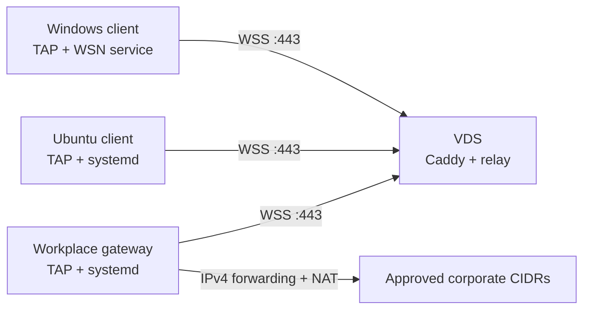

# WSN v2

WSN carries a private Ethernet segment through authenticated WebSockets. It is intended for environments where an administrator has approved outbound HTTPS/WebSocket access but a conventional VPN transport is unavailable.

WSN is not a replacement for workplace authorization. Deploy it only for networks and systems you are permitted to access.

## Architecture



The VDS is only an Ethernet relay and never joins the overlay. Each endpoint has a fixed client identity, random key, virtual MAC, and overlay address. Peers share the Layer-2 segment. The workplace gateway forwards only the configured corporate CIDRs, on all ports and protocols, and masquerades traffic so internal hosts can return it normally.

The gateway does not install WSN-specific `INPUT` firewall rules. Services already bound on its overlay address therefore remain governed by the host's existing firewall.

A deployment may also carry a corporate DNS server and the domains it answers for. Clients resolve only those domains through it and keep their existing resolvers for everything else, so home and public networks continue to work normally. The deployment is limited to a single gateway, which is the workplace side of one office.

The transport is Ethernet inside TLS inside TCP. On a lossy link the inner and outer congestion control compete, so throughput can drop sharply where a UDP-based VPN would degrade gently. This is inherent to tunnelling over WebSockets and is not an MTU fault.

## Security model

- TLS 1.3 uses a deployment-specific private CA. Clients load that CA only inside WSN; installers do not add it to an operating-system trust store.
- Authentication uses a fresh random challenge and per-client HMAC-SHA256 key. A key can be revoked without rotating every client.
- The relay binds each identity to a configured virtual MAC and rejects source-MAC spoofing.
- Client and relay queues are bounded; oversized frames and slow peers are disconnected.
- The root CA key and provisioning state stay on the administrator's machine and must be backed up encrypted. Only a leaf TLS key and the relay's client-key database go to the VDS.
- A generated client bundle contains that client's key. Transfer it privately, install it once, and delete the transfer copy.

Never reuse the historical v1 shared secret. If a credential has appeared in chat, shell history, a command line, or a world-readable unit file, rotate it.

## Build

Go 1.22.2 or newer is required to build the sources. Released binaries and the
relay image are built with a currently supported Go toolchain so they carry the
latest standard-library TLS fixes; `go.mod` only states the minimum language
version the code needs.

Linux clients require systemd, `iproute2`, and `/dev/net/tun`; gateway installations additionally require `iptables`. Windows installation requires elevated PowerShell and an official TAP-Windows driver. The VDS requires Docker Engine with the Compose plugin.

```sh
go test -race ./...
CGO_ENABLED=0 go build -o dist/wsn-server ./cmd/wsn-server
CGO_ENABLED=0 go build -o dist/wsn-client-linux-amd64 ./cmd/wsn-client
CGO_ENABLED=0 go build -o dist/wsnctl ./cmd/wsnctl
GOOS=windows GOARCH=amd64 CGO_ENABLED=0 go build -o dist/wsn-client-windows-amd64.exe ./cmd/wsn-client
```

Tagged GitHub releases build and attest Linux/Windows clients and `wsnctl`. They also publish `ghcr.io/masteraler/wsn:<tag>`. Production deployment must use a version tag or image digest, never `latest`.

Verify downloaded release artifacts before bundling them:

```sh
sha256sum -c SHA256SUMS
gh attestation verify ./wsn-client-linux-amd64 --repo MasterAler/wsn
```

## Provision a deployment

All commands below run on a trusted administrator machine. State defaults to `./wsn-state`, which is ignored by Git.

### 1. Select networks

Inspect the route table of every client and the gateway before selecting the overlay and corporate routes:

```sh
ip -br -4 address
ip -4 route show table main
```

The overlay must not overlap home LANs, Docker/VM networks, another VPN, or corporate destinations. Corporate routes should be the narrowest currently valid CIDRs.

Do not copy the old `172.16.0.0/12` route to the described Astra gateway: it overlaps `docker0` at `172.17.0.0/16`. The gateway installer deliberately rejects that configuration. Obtain the current narrower corporate CIDRs or readdress Docker first.

### 2. Initialize credentials and TLS

The following documentation addresses are examples only:

```sh
dist/wsnctl init \
  -state ./wsn-state \
  -public-ip 203.0.113.10 \
  -overlay 100.96.42.0/24 \
  -gateway 100.96.42.1 \
  -dns 10.0.0.53 \
  -search corp.example
```

This creates a ten-year root CA, a two-year relay leaf certificate containing the public IP SAN, and an initially empty relay configuration. Back up `wsn-state` encrypted and offline.

`-dns` and `-search` are optional and must be given together. They configure split DNS: the listed domains resolve through the corporate server, everything else keeps using each machine's existing resolvers. The DNS server must sit outside the overlay, and every client's routes must contain it — `add-client` rejects a client that could not reach it. Omit both flags to deploy without name resolution and reach corporate hosts by address.

Record the CA fingerprint this command prints. Each installer displays the fingerprint of the CA in its bundle, so colleagues can confirm out of band that they received your deployment and not a substituted one.

### 3. Add the workplace gateway

Routes are comma-separated canonical CIDRs. Replace these examples with authorized, collision-free current values:

```sh
dist/wsnctl add-client \
  -state ./wsn-state \
  -id workplace-gateway \
  -os linux \
  -role gateway \
  -address 100.96.42.1 \
  -device wsn0 \
  -egress eth0 \
  -routes 10.0.0.0/16,10.5.0.0/16,172.19.102.0/24
```

The gateway's corporate routes are used for forwarding validation and firewall/NAT rules. They are not installed via the overlay. A deployment has exactly one gateway; adding a second is rejected.

The gateway does not receive the deployment's DNS settings. It already sits on the corporate network and keeps its own resolver.

### 4. Add any number of clients

```sh
dist/wsnctl add-client \
  -state ./wsn-state \
  -id alice-windows \
  -os windows \
  -address 100.96.42.2 \
  -routes 10.0.0.0/16,10.5.0.0/16,172.19.102.0/24

dist/wsnctl add-client \
  -state ./wsn-state \
  -id bob-ubuntu \
  -os linux \
  -address 100.96.42.3 \
  -routes 10.0.0.0/16,10.5.0.0/16,172.19.102.0/24
```

Addresses and MACs must be unique, but there is no two-user limit:

```sh
dist/wsnctl list-clients -state ./wsn-state
```

### 5. Or enrol a colleague in one step

`enroll` takes the same flags as `add-client` plus the bundle flags, and performs `add-client`, `bundle`, and `server-bundle` together so the three artefacts cannot drift apart. If the bundle cannot be built the client is rolled back out of the state rather than left half-provisioned.

```sh
dist/wsnctl enroll \
  -state ./wsn-state \
  -id bob-ubuntu \
  -os linux \
  -address 100.96.42.3 \
  -routes 10.0.0.0/16,172.19.102.0/24 \
  -client-binary ./dist/wsn-client-linux-amd64
```

It writes the client bundle and a refreshed `wsn-server-private.tar.gz`; deploy the latter with `reload.sh` as described below.

## Deploy the VDS

Install Docker Engine and the Compose plugin from Docker's official Ubuntu instructions. Configure the host/provider firewall to expose the chosen SSH port and `443/tcp` only.

Create a server-only archive. It intentionally excludes the root CA key and full provisioning state:

```sh
dist/wsnctl server-bundle -state ./wsn-state -output wsn-server-private.tar.gz
```

On the VDS:

```sh
git clone https://github.com/MasterAler/wsn.git /opt/wsn
cd /opt/wsn/deploy/server
cp .env.example .env
# Set the real static IP and immutable relay image tag/digest in .env.
mkdir /root/wsn-server-private
tar -xzf /path/to/wsn-server-private.tar.gz -C /root/wsn-server-private
sudo ./install.sh /root/wsn-server-private
```

Compose publishes only Caddy on `443/tcp`. The relay has no host port and accepts trusted proxy metadata only from the private Compose network. Logs rotate at 10 MiB with three files, and each service is limited to 128 MiB.

After adding or revoking a client, copy the fresh server bundle to the VDS and run `reload.sh` instead of `install.sh`:

```sh
sudo ./reload.sh /root/wsn-server-private
```

This signals the relay to re-read its client list. Sessions that are still authorized keep running, and a revoked identity is disconnected immediately rather than surviving until the next restart. Use `install.sh` when the relay image or the TLS certificate changed; that path recreates the containers and briefly drops every session.

Renew the leaf certificate before its two-year expiry without changing clients:

```sh
dist/wsnctl rotate-certificate -state ./wsn-state
dist/wsnctl server-bundle -state ./wsn-state -output wsn-server-private.tar.gz
```

Check expiry from a monthly timer or monitoring job on the VDS:

```sh
/opt/wsn/deploy/server/check-certificate.sh
```

It exits nonzero when fewer than 30 days remain.

## Create and install client bundles

### Ubuntu 22.04/24.04 and Astra gateway

```sh
dist/wsnctl bundle \
  -state ./wsn-state \
  -id bob-ubuntu \
  -client-binary ./dist/wsn-client-linux-amd64 \
  -output bob-ubuntu-linux.tar.gz
```

For Astra, build the same static binary locally if desired:

```sh
CGO_ENABLED=0 GOOS=linux GOARCH=amd64 go build -trimpath -o wsn-client ./cmd/wsn-client
```

Generate the gateway bundle with `-id workplace-gateway`. Transfer, extract, and install either Linux bundle:

```sh
tar -xzf CLIENT-linux.tar.gz
cd CLIENT-linux
sudo ./install-linux.sh
systemctl status wsn-net wsn-client
# The gateway additionally has wsn-gateway.service.
```

The installer:

- creates a locked `wsn` system user;
- validates existing kernel routes before changing networking;
- creates the TAP and persistent routes through a oneshot unit;
- programs split DNS through `resolvectl` when the deployment defines a resolver;
- runs the client unprivileged with systemd hardening;
- enables forwarding and dedicated `WSN_FORWARD`/`WSN_POSTROUTING` chains only for gateway bundles;
- prints the relay CA fingerprint for out-of-band comparison.

The gateway script does not modify `INPUT`. Its forwarding chain allows every port/protocol inside configured corporate CIDRs, rejects other WSN forwarding, and removes only its own rules on uninstall.

### Windows 10/11 x64

Obtain the official signed TAP-Windows installer and matching `tapctl.exe` from OpenVPN. Keep their original signatures. `wsnctl` records their SHA-256 hashes in the private bundle, and the installer additionally requires a valid OpenVPN Authenticode signer.

```sh
dist/wsnctl bundle \
  -state ./wsn-state \
  -id alice-windows \
  -client-binary ./dist/wsn-client-windows-amd64.exe \
  -tap-installer /secure/path/tap-windows-installer.exe \
  -tapctl /secure/path/tapctl.exe \
  -output alice-windows.zip
```

Transfer the ZIP privately. Extract it, open an elevated PowerShell in that directory, and run:

```powershell
Set-ExecutionPolicy -Scope Process Bypass
.\install-windows.ps1
Get-Service WSNClient
```

The installer rejects overlapping routes, installs the signed driver, creates the fixed-MAC TAP adapter, adds persistent routes, adds NRPT rules so only the deployment's domains resolve through the corporate server, protects configuration for SYSTEM and Administrators, configures service recovery, and prints the relay CA fingerprint. `uninstall-windows.ps1` removes WSN and its NRPT rules while retaining the shared TAP driver.

### Manual upgrades and rollback

Verify the new generic client artifact and its GitHub attestation first. Then use the upgrade helper from the original private bundle; configuration and identity are preserved:

```sh
sudo ./upgrade-linux.sh ./wsn-client-linux-amd64 EXPECTED_SHA256
sudo ./rollback-linux.sh
```

```powershell
.\upgrade-windows.ps1 -Binary .\wsn-client-windows-amd64.exe -Sha256 EXPECTED_SHA256
.\rollback-windows.ps1
```

Each upgrade retains one previous binary and automatically restores it if the service cannot restart.

## Operations

Revoke a lost or retired client and redeploy the server bundle:

```sh
dist/wsnctl revoke-client -state ./wsn-state -id alice-windows
dist/wsnctl server-bundle -state ./wsn-state -output wsn-server-private.tar.gz
# then, on the VDS, after extracting the bundle:
sudo /opt/wsn/deploy/server/reload.sh /root/wsn-server-private
```

Confirm the revocation took effect:

```sh
docker compose logs --tail=20 relay | grep reloaded
```

For Linux diagnostics:

```sh
systemctl status wsn-net wsn-client wsn-gateway
journalctl -u wsn-client -u wsn-gateway --since today
ip address show wsn0
ip route
sudo iptables -S WSN_FORWARD
sudo iptables -t nat -S WSN_POSTROUTING
```

For VDS diagnostics:

```sh
cd /opt/wsn/deploy/server
docker compose ps
docker compose logs --tail=200 relay caddy
curl -o /dev/null -w '%{http_code}\n' --cacert /secure/path/relay-ca.crt https://PUBLIC_IP/
curl -o /dev/null -w '%{http_code}\n' --cacert /secure/path/relay-ca.crt https://PUBLIC_IP/wsn
```

The first request must return `404` and the second must return `400`. The `400` is the relay rejecting a plain HTTP request on its WebSocket path, and it is the check that matters: a `404` there means Caddy is answering the relay's path itself and no client can ever connect. Testing only `/` cannot distinguish a healthy deployment from that failure.

Client logs should show an authenticated session after installation.

## Scope exclusions

WSN configures split DNS for the domains named at `init` and nothing further: it does not manage host entries, corporate certificate authorities, CIFS mounts, workplace user accounts, or SSH keys. In particular, do not restore SMB1 mount commands or inline share passwords as part of this deployment.

Name resolution is best effort. If a client cannot program its resolver the tunnel still comes up and logs a warning; corporate hosts remain reachable by address.

## History and attribution

WSN v2 is a full rewrite. It keeps the original idea — a private Ethernet segment carried over an authenticated WebSocket, relayed by virtual MAC — but no source file from it survives.

The original WSN (2024, `assenovich`) was a 237-line Go relay with Qt/C++ clients and hand-maintained `systemd-networkd` units. It authenticated every peer with one shared secret against `sha256(challenge‖secret‖challenge)`, drew that challenge from `math/rand`, and let each client declare whatever MAC it liked.

v2 replaces all of it. Each peer has its own 32-byte key and proves possession with HMAC-SHA256 over a `crypto/rand` challenge bound to both its identity and its virtual MAC, so a key can be revoked on its own and a peer cannot spoof another's source address. The relay gives each peer its own bounded queue, read limit, and idle and write deadlines, and disconnects one that falls behind; the original set no deadline or limit anywhere and wrote to every peer synchronously from a single router goroutine, so one stalled client held up the whole segment. Everything around it is new: `wsnctl` provisioning with a deployment-specific CA, reproducible client bundles, signed-driver Windows and systemd Linux installers, a workplace gateway confined to named corporate CIDRs, split DNS, and a containerized relay behind Caddy.

Both the earlier work and this one are covered by the MIT license reproduced in `LICENSE`.
